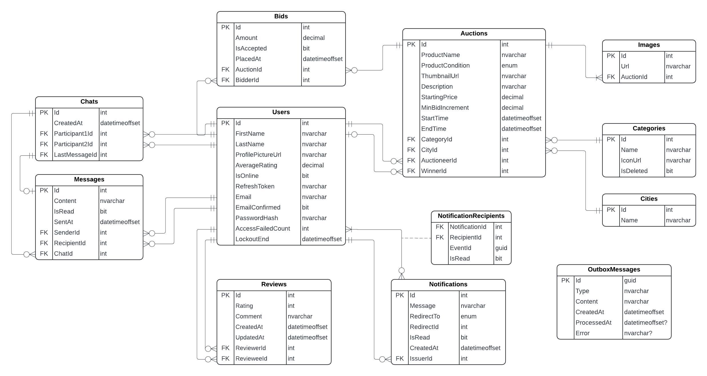

# AuctionX — Real-Time Auction Platform API

A backend API for a live auction platform built with **ASP.NET Core 9**. Users can list items, place competitive bids, accept winning bids, chat privately with the winner, and receive instant notifications — all powered by WebSockets via SignalR.

---

## Tech Stack

| Layer | Technology |
|---|---|
| Framework | ASP.NET Core 9 |
| ORM | Entity Framework Core 9 (Code First) |
| Database | Microsoft SQL Server 2022 |
| Real-Time | ASP.NET Core SignalR |
| Authentication | ASP.NET Core Identity + JWT + Google OAuth (OpenID Connect) |
| Background Jobs | Quartz.NET |
| Email | Brevo (Transactional Email API) |
| Image Storage | Cloudinary |
| Logging | Serilog |
| Containerization | Docker + Docker Compose |

---

## Features

### Auctions
- Create an auction with product images, starting price, minimum bid increment, duration, category, and city
- Browse the feed with filters: category, city, product condition (New/Used), active-only, and keyword search
- Paginated results on all listing endpoints
- Live feed updates (new auction, deleted, ended, price changed) pushed to all subscribed clients

### Bidding
- Place and accept bids in real time via SignalR — no polling
- Bid validation: auctioneer cannot bid on their own auction, bid must exceed current price by the minimum increment, auction must still be active
- Accepting a bid immediately ends the auction and notifies all participants

### Real-Time Chat
- Private chat channel between the auction winner and the auctioneer only
- Read receipts (per-message and mark-all-read)
- Online/offline status pushed to chat participants on connect/disconnect
- Unread chat count pushed to the user on connection

### Notifications
- In-app notifications when a bid is placed (notifies auctioneer + previous highest bidder) and when a bid is accepted (notifies winner + all other bidders)
- Delivered reliably via the **Outbox Pattern** — notifications are written atomically with the bid and processed by a background job
- Unread count pushed in real time via SignalR

### Reviews
- Leave a review only if you were the winner or auctioneer on the same completed auction
- One review per pair — duplicate attempts return 409
- `User.AverageRating` kept in sync automatically via a SQL trigger

### Authentication
- Email/password registration with email confirmation (link sent via Brevo)
- Google sign-in — client sends `idToken`, server validates it server-side via `Google.Apis.Auth`
- JWT access tokens (30-minute expiry, HMAC-SHA256)
- Refresh tokens stored in DB; delivered as HTTP-only CHIPS partitioned cookie for browsers, response body for mobile
- Account lockout after repeated failed login attempts
- Forgot password / reset password via emailed token
- Change password while authenticated

### Admin
- Category management (add, update, soft-delete) — SVG icon upload via Cloudinary
- Admin account seeded automatically on startup from environment variables

---

## Architecture

The solution is split into **three projects**:

```
AuctionX (solution)
├── BidX.Presentation     — Controllers, SignalR Hub, Background Job, Middleware, DI setup
├── BidX.BusinessLogic    — Services, DTOs, Interfaces, Domain Events, MediatR Handlers
└── BidX.DataAccess       — AppDbContext, Entities, EF Configurations, Migrations, SQL Triggers
```

Dependency direction is strictly one-way: `Presentation → BusinessLogic → DataAccess`.

**Request flow:**
```
HTTP Client
  → Controller
  → Service (injected via interface)
  → AppDbContext (EF Core)
  → SQL Server
  → DTO response returned

SignalR action (e.g. PlaceBid):
  → Hub method
  → Service
  → DB save + OutboxMessage written (same transaction)
  → SignalR broadcasts to group
  → (1 second later) Quartz job processes OutboxMessage → MediatR event → notification saved → SignalR pushes unread count
```

---

## Database Design

EF Core Code First with manual optimizations:

### Denormalization
| Column | Why |
|---|---|
| `Chat.LastMessageId` | Avoids a correlated subquery on every chat list fetch |
| `User.AverageRating` | Avoids a `GROUP BY AVG` join on every profile card |

### SQL Triggers
- `last_message_trigger` — fires `AFTER INSERT` on `Message`, updates `Chat.LastMessageId`
- `average_rating_trigger` — fires `AFTER INSERT, UPDATE, DELETE` on `Review`, recalculates `User.AverageRating`

Both triggers are defined in `src/BidX.DataAccess/SQL/` and applied via EF Core migrations.

### Covering Indexes
| Index | Query it supports |
|---|---|
| `Chat(Participant1Id) INCLUDE (Participant2Id, LastMessageId)` | Fetch all chats for a user |
| `Chat(Participant2Id) INCLUDE (Participant1Id, LastMessageId)` | Same, for the other participant |
| `Bid(AuctionId, Amount, IsAccepted) DESC` | Get highest bid / current price |
| `Auction(EndTime)` | Filter active auctions |
| `User(RefreshToken)` | Refresh token lookup |

### Outbox Pattern
Events like `BidPlacedEvent` and `BidAcceptedEvent` are written to an `OutboxMessages` table in the same DB transaction as the bid. A Quartz.NET job polls every second, deserializes the event, publishes it via MediatR, and marks it processed. Idempotency is enforced by a unique constraint on `(RecipientId, EventId)` in `NotificationRecipient`.

### ER Diagram


---

## API Overview

| Group | Endpoints |
|---|---|
| Auth | Register, Confirm Email, Login, Google Login, Refresh, Forgot Password, Reset Password, Change Password, Logout |
| Auctions | List (with filters), Get details, Create, Delete |
| Bids | List bids, Get highest bid, Get accepted bid |
| Users | Get profile, Update profile, Update profile picture, Created auctions, Bidded auctions |
| Chats | List chats, Create/get chat, Get messages |
| Reviews | List reviews, Add, Get mine, Update mine, Delete mine |
| Notifications | List notifications |
| Categories | List, Get, Add (Admin), Update (Admin), Delete (Admin) |
| Cities | List |

SignalR hub at `/hub`:

| Method (Client → Server) | Description |
|---|---|
| `PlaceBid` | Submit a bid |
| `AcceptBid` | Auctioneer accepts a bid |
| `JoinAuctionRoom / LeaveAuctionRoom` | Subscribe/unsubscribe to auction updates |
| `JoinFeedRoom / LeaveFeedRoom` | Subscribe/unsubscribe to feed updates |
| `SendMessage` | Send a chat message |
| `MarkMessageAsRead / MarkAllMessagesAsRead` | Mark messages read |
| `JoinChatRoom / LeaveChatRoom` | Subscribe/unsubscribe to chat updates |
| `MarkNotificationAsRead / MarkAllNotificationsAsRead` | Mark notifications read |

---

## Error Response Format

All errors (HTTP and SignalR) use the same shape:

```json
{
  "errorCode": "BIDDING_NOT_ALLOWED",
  "errorMessages": ["Bid amount must be greater than the current price."]
}
```

Full list of error codes: [`ErrorCode.cs`](src/BidX.BusinessLogic/DTOs/CommonDTOs/ErrorCode.cs)

---

## Setup & Run

### Prerequisites
- [Docker](https://www.docker.com/) and Docker Compose

### Steps

**1. Clone the repo**
```bash
git clone https://github.com/sharnam20/AuctionX.git
cd AuctionX
```

**2. Create environment files**

Rename the example files:
```
webapi.env.example   →   webapi.env
sqlserver.env.example →  sqlserver.env
```

Fill in `webapi.env` with:
```
BIDX_DB_CONNECTION_STRING=...
BIDX_JWT_SECRET_KEY=...
BIDX_ADMIN_EMAIL=...
BIDX_ADMIN_PASSWORD=...
CLOUDINARY_CLOUDNAME=...
CLOUDINARY_APIKEY=...
CLOUDINARY_APISECRET=...
GOOGLE_CLIENT_ID=...
BREVO_API_KEY=...
```

**3. Update `appsettings.json`** if needed (frontend origin, email template IDs, etc.)

**4. Start the containers**
```bash
docker-compose up --build
```

- API: `http://localhost:5000`
- SQL Server: `localhost:1433`

Database migrations run automatically on startup. Roles, admin account, cities, and categories are seeded if not already present.

---

## Project Structure

```
src/
├── BidX.Presentation/
│   ├── Controllers/          # HTTP API controllers
│   ├── Hubs/                 # SignalR Hub (partial classes per feature)
│   ├── BackgroundJobs/       # Quartz.NET OutboxProcessorJob
│   ├── Utils/                # DI extensions, global exception handler
│   └── Program.cs
│
├── BidX.BusinessLogic/
│   ├── Services/             # Business logic (Auth, Auctions, Bids, Chat, etc.)
│   ├── Interfaces/           # Service contracts
│   ├── DTOs/                 # Request/Response objects
│   ├── Events/               # Domain events (BidPlacedEvent, BidAcceptedEvent)
│   ├── Handlers/             # MediatR notification handlers
│   └── Extensions/           # Mapping extensions (no AutoMapper)
│
└── BidX.DataAccess/
    ├── Entites/              # EF Core entity classes
    ├── Configs/              # IEntityTypeConfiguration per entity
    ├── Migrations/           # EF Core migrations
    ├── SQL/                  # Raw SQL trigger files
    └── AppDbContext.cs
```

---

## Future Improvements

- Rate limiting on bid and message endpoints
- Full-text search index on `ProductName` (current LIKE search is non-sargable)
- Hashed refresh token storage
- Image moderation before Cloudinary upload
- Spam bid detection
